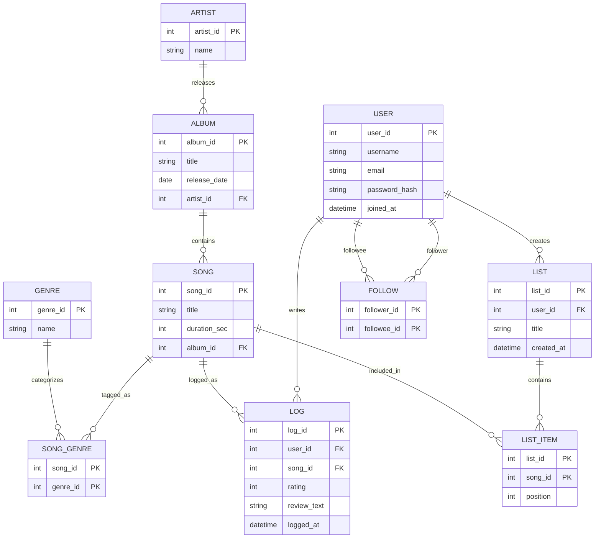

# ERD — song logging & rating platform

## Design notes

- **`LOG` is both a diary entry and a review.** A user can log the same
  song multiple times (`log_id` is its own surrogate key, not a composite
  of user+song), mirroring Letterboxd's "rewatch" diary entries. `rating`
  and `review_text` are both optional on top of the required listen event.
- **`SONG_GENRE` and `LIST_ITEM` are junction tables** resolving the two
  many-to-many relationships in the schema (song↔genre, list↔song).
  `LIST_ITEM.position` supports ranked lists (e.g. "top 10 songs of 2025").
- **`FOLLOW` is self-referencing on `USER`** (`follower_id`, `followee_id`)
  to model the social graph.
- Artist name and album title are *not* duplicated onto `SONG` — they're
  reached via `ALBUM.artist_id` and `SONG.album_id` respectively, which is
  what keeps the schema from having a transitive dependency (see
  `normalization.md`).

## Future work (next sprint — Advanced Relational Design)

- `LIKE` (user likes a `LOG`) and `COMMENT` (user comments on a `LOG`) —
  both straightforward junction/child tables on `LOG`.
- Indexing strategy for common queries (e.g. a user's diary feed, a song's
  average rating).
- Views for aggregate stats (e.g. average rating per song).
