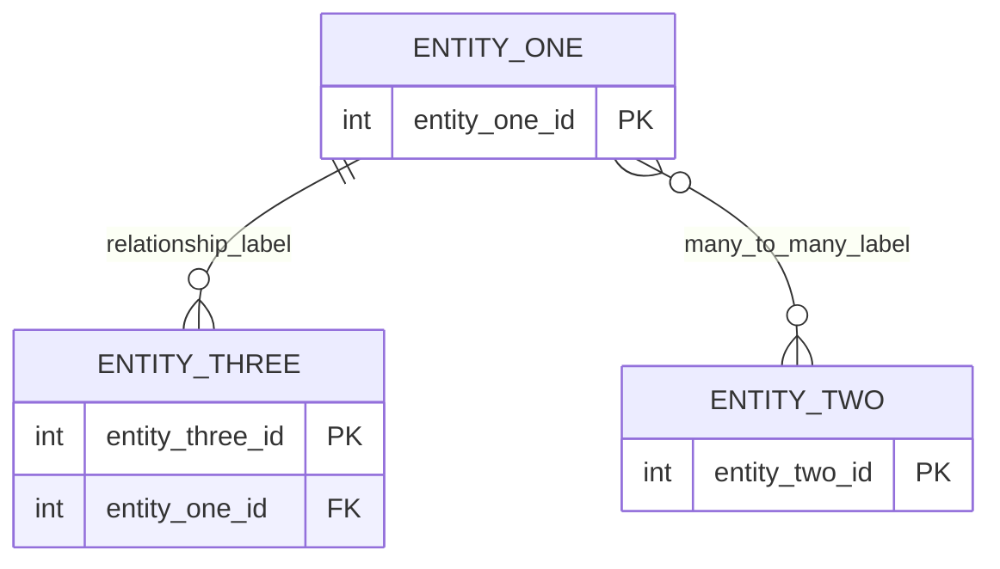

# ERD — [project name TBD]

Draw the entity-relationship diagram as a Mermaid `erDiagram`. Mermaid
renders automatically in GitHub, GitLab, and VS Code's Markdown preview.

**Cardinality symbols** (put the right one on each end of a relationship):
- `||` — exactly one
- `o|` — zero or one
- `}o` / `o{` — zero or many
- `}|` / `|{` — one or many

For each entity box, list every attribute and mark:
- `PK` — primary key (uniquely identifies the row)
- `FK` — foreign key (references another entity's PK)

## Design notes

Explain key decisions here — e.g.:
- Why a relationship is one-to-many vs. many-to-many
- Any surrogate keys used instead of natural keys, and why
- Anything non-obvious about the model that isn't clear from the diagram
  alone

## Future work (next sprint)

What's planned for the next sprint (Advanced Relational Design) — new
tables, relationships not yet modeled, indexing strategy, etc.
